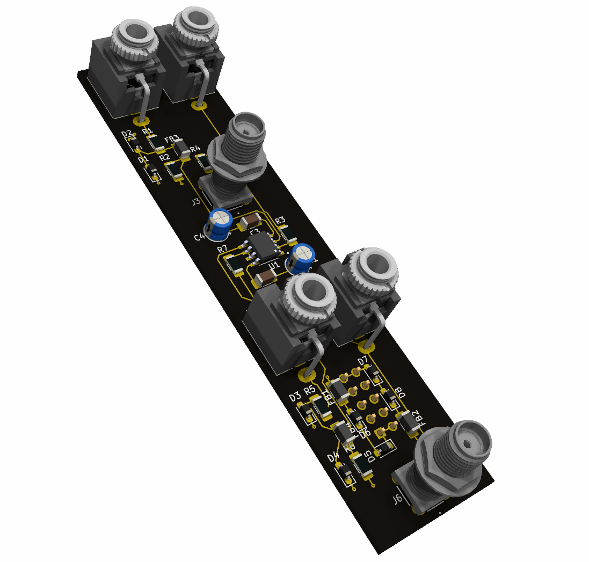

# spectrum portal

## about
Spectrum Portal is a **work-in-progress** open-hardware Eurorack module for interfacing with an oscilloscope, spectrum analyzer, frequency counter, or other device of interest. 

## features
- Connect up to two Eurorack signals to two dedicated SMA outputs (and then hook up to your scope with a BNC-SMA adapter)
- Keep a copy of your signals using a built-in buffered multiple, one for each of the two inputs.
- A whole butt ton of circuit protection mechanisms with many pairs of belts and suspenders.

## motivations
- Seeing and studying the waveforms you're creating is a fantastic tool for exploring synthesis. It's a really exciting thing to see, and it really enhances my modular experience. 
- Modules with a built in Oscilloscope are pretty cool. But I already have a dedicated Oscilloscope that would fit the bit really nicely, plus I'd love to be able to hookup a modular to an analog CRT scope for the coolness factor.
- I'm fascinated by oscilloscope art and am excited by the possibilities of creating oscilloscope art with a modular synth.
- I wanted something more robust than a passive adapter/cable, that lived inside the rack as a dedicated module. 
- I just want to design and build eurorack modules.
- I want to further the proliferation of open-hardware eurorack modules across the galaxy

## design goals
- Open-hardware
- Must be fully user-servicable and user-buildable (big SMD components that are easy to hand-solder are fine, tiny packages that require specialized equipment is not fine)
- Strike a good compromise between features, quality, size and cost. Quality comes at the expense of added cost, features come at the expense of added size (and added cost).

## contributing
Contributions are heavily encouraged! There are many areas where the design can be significantly improved (it's still a work-in-progress, afterall).

## licensing
- The hardware is licensed under the strongly reciprocal variant of the [CERN Open Hardware License](https://ohwr.org/project/cernohl/wikis/Documents/CERN-OHL-version-2) (specifically CERN-OHL-S).
- There's no source code for this module, it's a pure hardware affair. But any future modules that have firmware will have that firmware licensed under the GNU GPL v3.
- There's no documentation (yet), but any future documentation will be licensed under an appropriate open-source license.
